# Operationalizing an AWS ML Project
## Dog Breed Image Classification using AWS SageMaker and PyTorch

In this project, several important tools and features of AWS are used to adjust, improve, configure, and prepare a ML model for production deployment. The project contains code that trains and deploys an image classification model on AWS Sagemaker.

The project is performed following the next steps:

Step 1: Training and deployment on AWS Sagemaker.  
Step 2: Training using EC2.  
Step 3: Lambda function setup for inference.  
Step 4: Lambda security setup and testing.  
Step 5: Lambda concurrency setup and endpoint auto-scaling.  


## Step 1: Training and deployment on AWS Sagemaker

The training process is performed using a Notebook instance on Sagemaker. A small instance type such as ```ml.t3.medium``` (2 vCPU and 6 GiB of memory) is selected for the project, since this meets the requirements for running the ```train_and_deploy-solution.ipynb``` notebook at the lowest cost of $ 0.05 per hour.  

The following image shows the notebook instance created:  

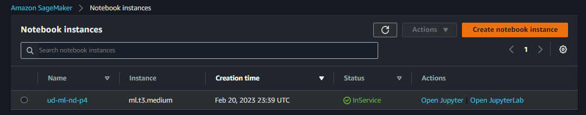  

The model is trained on both single and multiple instances using a ```ml.g4dn.xlarge``` instance type. For practical purposes, the training halts at the first epoch. Then, the models from single instance and multiple instance training jobs are deployed, as follows:

- Single-instance training:  
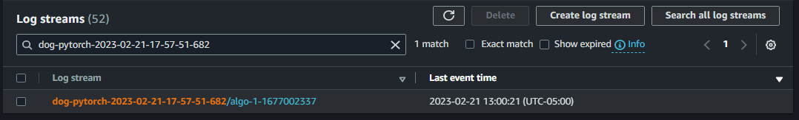  
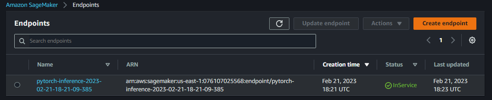  


- Multi-instance training:  
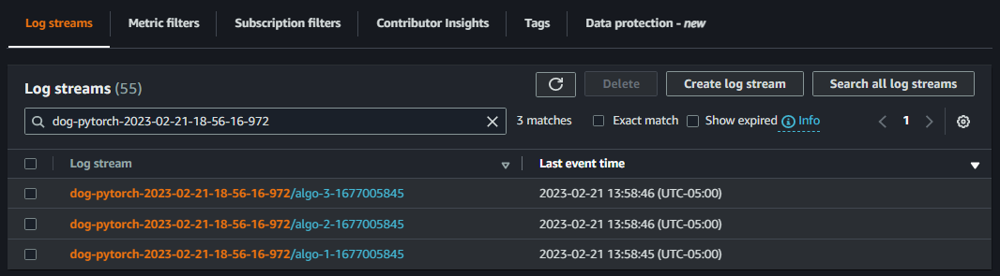  
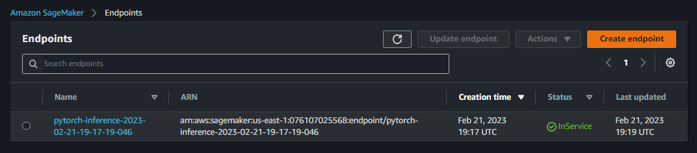  


## Step 2:  Training on EC2
An alternative for training a model is using an EC2 instance instead of Sagemaker. In this scenario, a script adapted from the notebook is necessary. The instance type chosen for training the model on EC2 is the same ```ml.g4dn.xlarge```,  since it meets the computing requeriments at a lower cost for processing and training. As said before, for practical purposes, the training will halt at the first epoch.

The following images shows the EC2 instance and the terminal running the ```ec2train1.py``` script for training the model.

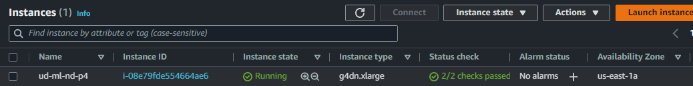    
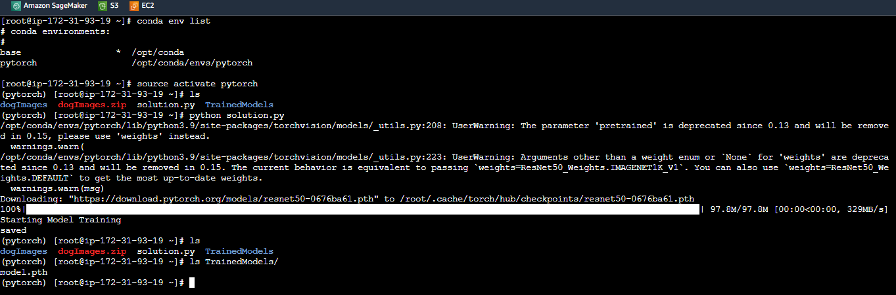  


## Step 3: Lambda function setup  
After training and deploying the model, setting up a Lambda function, using the ```lamdafunction.py``` script, is an important task as this enables the model to be accessed by API's and other programs. 


## Step 4: Lambda security setup and testing
A Lambda function requires the proper security policies attached to it in order to invoke a deployed endpoint. Attaching a full access policy would add security vulnerabilities. For this reason, using the IAM interface, a limited policy that allows a user to invoke a specific endpoint (or all own endpoints) is created and attached to the Lambda role, as follows:

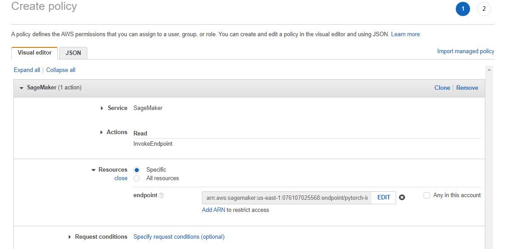    
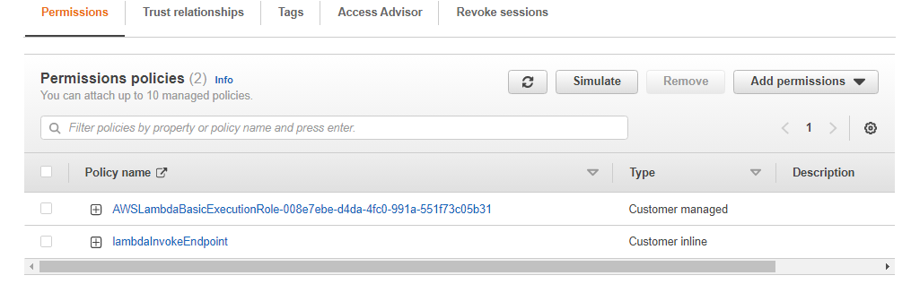  

The results of a successful invoking test performed on the Lambda function are shown below:

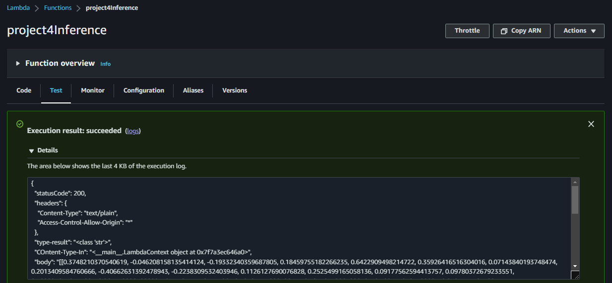    

```json
{
  "statusCode": 200,
  "headers": {
    "Content-Type": "text/plain",
    "Access-Control-Allow-Origin": "*"
  },
  "type-result": "<class 'str'>",
  "COntent-Type-In": "<__main__.LambdaContext object at 0x7f7a3ec646a0>",
  "body": "[[0.3748210370540619, -0.046208158135414124, -0.19332340359687805, 0.18459755182266235, 0.6422909498214722, 0.35926416516304016, 0.07143840193748474, 0.2013409584760666, -0.40662631392478943, -0.2238309532403946, 0.1126127690076828, 0.2525499165058136, 0.09177562594413757, 0.09780372679233551, 0.5082946419715881, 0.2655788064002991, 0.3439544439315796, -0.4079475402832031, -0.18330448865890503, 0.4885449707508087, 0.2703157365322113, 0.15254491567611694, 0.4578859508037567, 0.4886816740036011, -0.2267102301120758, 0.06121187284588814, 0.08620661497116089, -0.07932054996490479, 0.49667492508888245, 0.3141535520553589, 0.07674485445022583, 0.1663159877061844, -0.25284793972969055, 0.21378761529922485, 0.25132060050964355, 0.5610526204109192, 0.18995662033557892, 0.13628947734832764, 0.1684465855360031, -0.15521439909934998, 0.4581757187843323, 0.1620015799999237, 0.30257973074913025, 0.09637795388698578, 0.04541651904582977, 0.1521347463130951, -0.08743750303983688, 0.04993806779384613, -0.20915032923221588, -0.21284787356853485, -0.02543587237596512, 0.1883545070886612, -0.30492720007896423, 0.18603497743606567, -0.2546696066856384, 0.1975076049566269, 0.4556020200252533, 0.16756783425807953, 0.12390435487031937, -0.1146358922123909, 0.11059819906949997, -0.11682835221290588, 0.0710432380437851, -0.4874916970729828, 0.05493775010108948, -0.4273858070373535, -0.10279837250709534, 0.12126364558935165, 0.29550567269325256, 0.18309897184371948, 0.06595314294099808, -0.025738196447491646, -0.30459538102149963, 0.01492330338805914, -0.15622296929359436, 0.18880636990070343, -0.2251722812652588, -0.2873472273349762, 0.1890975534915924, -0.003290688619017601, -0.10139472037553787, 0.29221588373184204, 0.055993661284446716, 0.1098623126745224, -0.1766642928123474, 0.08243223279714584, 0.3377177119255066, 0.06499467045068741, 0.24551309645175934, 0.3099081516265869, -0.04492253065109253, -0.2474137842655182, -0.5685271620750427, -0.3114491403102875, -0.39963656663894653, -0.33272674679756165, -0.08196931332349777, -0.1892833411693573, -0.09226399660110474, -0.4018873870372772, -0.06535250693559647, -0.4086303412914276, -0.07361125200986862, -0.02084951475262642, -0.508001446723938, -0.1040288507938385, -0.4590185582637787, -0.9188807606697083, -0.010974306613206863, -0.4687262773513794, -0.05386451259255409, 0.1874505877494812, -0.014306633733212948, -0.3130384385585785, 0.3803076446056366, -0.5665944814682007, -0.14233903586864471, -0.19892369210720062, -0.6708981990814209, -0.24014577269554138, -0.7050748467445374, -0.48393329977989197, -0.051612406969070435, -0.26194262504577637, -0.480593204498291, -0.6064732670783997, 0.01859777607023716, -0.3616325557231903, 0.152866393327713, 0.26529568433761597, -0.5362987518310547, -0.5450462102890015, -0.34911587834358215]]"
}
```  


## Step 5: Lambda concurrency setup and endpoint auto-scaling  

In order to prepare a Lambda function to respond to high traffic demand with low latency, i.e  multiple invocations at once, provisioned concurrency can be set up. The price depends on the amount of memory is allocated to the function and the amount of concurrency. For the purposes of this project, a small amout of concurrency is set up, as follows:

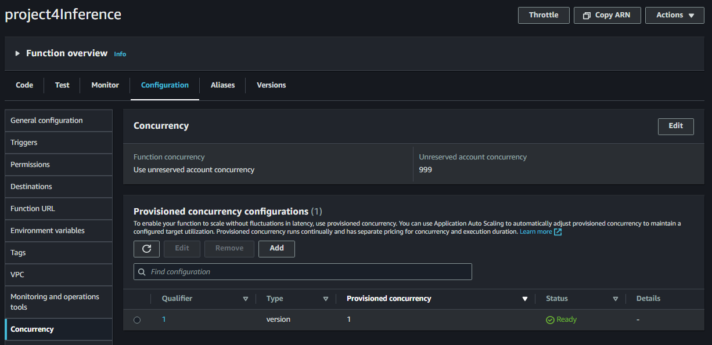    

Finally, like Lambda functions use concurrency to respond to multiple requests at the same time, Sagemaker endpoints require automatic scaling to perform in a similar scenario. For this project, the auto-scaling setup with a maximun of 2 instances is shown in the following image:  


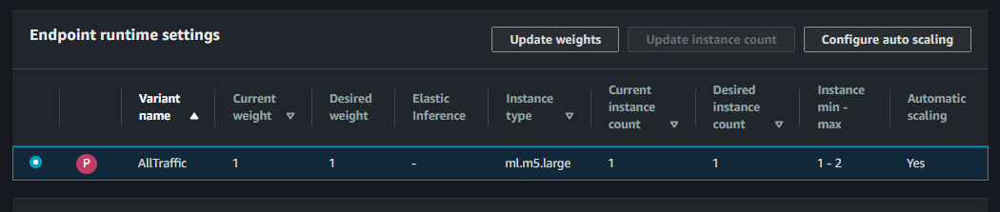 


